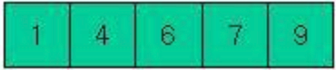
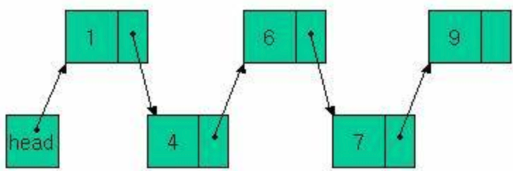

# ArrayList vs LinkedList
## ArrayList
- 배열로 저장되어 있어 인덱스를 가지고 있기 때문에 검색이 빠르다. (**O(1)**)
- 삽입/삭제할 때 해당 위치 뒤의 모든 데이터가 한 칸씩 이동해야 하므로 느리다. (**O(N)**)
- JAVA에서는 `AbstractList`를 상속받는다.

## LinkedList
- 배열 형태가 아닌 현재 데이터는 다음 데이터를 가르키고 있는 주소를 가지고 있으므로 삽입/삭제가 빠르다. (**O(1)**)
- 검색을 하려면 반드시 처음(head)부터 다음 주소를 따라가야하므로 느리다. (**O(N)**)
- JAVA에서는 `AbstractSequentialList`를 상속받는다.

