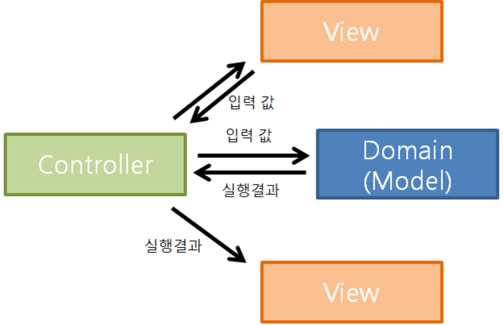

# MVC 패턴
MVC 패턴은 Model, View, Controller가 각각의 역할을 분리한 개발 방법론이다. 이는 주로 웹에서 사용하였고, 웹 쪽은 뒤에 따로 설명할 예정이다.
- Model: 핵심 비즈니스 로직
- View: 사용자에게 보여주는 로직
- Controller: 사용자에게 입력을 받아 적절한 Model과 View를 선정하여 처리하는 로직

웹에서 역시 위 역할을 크게 벗어나지 않는다. 웹뿐 아니라 다른 종류의 애플리케이션도 이 패턴을 적용할 수 있다.

